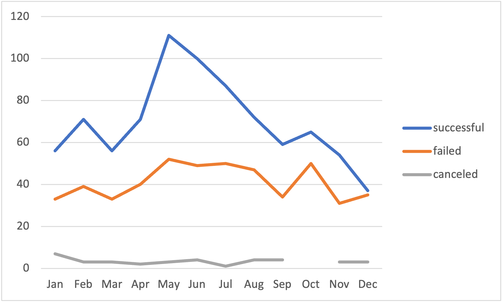
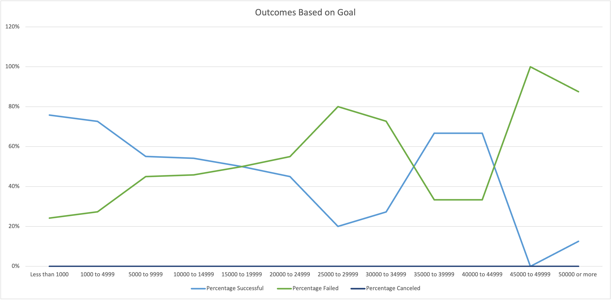

# Kickstarting with Excel

## In this project, we continued to perform analysis for Louise after her play, “Fever,” came close to its fundraising goal in a short amount of time. Using our Kickstarter dataset, we visualized outcomes based off their launch dates and fundraising goals. The purpose of this project, the methods we used to achieve these visualizations, the challenges we encountered and the insights they gave us are outlined below. 

### After the launch of Louise’s first Kickstarter, she wanted to know how campaigns fare in relation to their launch dates and fundraising goals. By finding this information and presenting it to Louise, we are allowing her greater opportunity to run successful Kickstarter campaigns for her plays. Further, we are explaining to her in common sense terms how we reached our conclusions and how she can use these findings to her advantage. 

## Now that we have given and overview of the project and explained its purpose, we will share our analysis of outcomes based on launch date. Following this, we will display our analysis of outcomes based on goals. Finally, we will explain the challenges and difficulties we encountered while conducting our analysis. 

### To analyze outcomes of Kickstarters for theater based off launch date, we collected the outcomes of all theater Kickstarters in our data that were successful, failed, or canceled. We then filtered these results by month to find the best time of year to launch a Kickstarter campaign for theater. These results are seen here.

### To analyze outcomes of Kickstarters for theater based on goals, we calculated the percentage of campaigns that were successful, failed or canceled based on the funding goal amount. We then displayed our findings in a line chart. The line chart resulting from our analysis is seen here.

### The challenges we encountered while conducting this analysis are the same challenges that are usually encountered while working with data. For example, the challenge of making sure the data was correctly sorted and filtered. Once that data and formulas were correctly organized and input, we were able to conduct the analysis with no further challenges. 

## Our results are visualized in the above figures, “Theater Outcomes by Launch Date” and “Outcomes Based on Goal.” Our analysis was successful and our visualizations show identifiable trends. The conclusions we reached based off these visualizations are outlined below. 

- There are at least two clear conclusions to be reached from our “Theater Outcomes Based on Launch Date” visualization. The first is that May is the best month to launch a Kickstarter campaign for theater. Not only were the most successful campaigns launched in May, but May was also the month with the highest proportion on successful to failed campaigns. The second conclusion we can reach is that December is the worst time to launch a Kickstarter campaign for theatre. This is the month where the trend lines for successful and failed campaigns are closest together, and also the month with the lowest number overall of successful campaigns. 

- Our “Outcomes based on Goals” visualization allows us to reach at least one conclusion. This conclusion is that campaigns with smaller goals succeed at a higher rate than those with large goals. This is demonstrated by the goal range with the highest success rate being the smallest goal range, ‘Less than 1000.”

- Although our dataset allowed good insights, it does have some weaknesses. One flaw is that we are analyzing Kickstarter campaigns from around the world, not in Great Britain specifically, which is where Louise plans to run her campaign. Another weakness is that the data ranges from 2009 to 2017, and economic and social conditions have changes greatly since this time. 

- We are confident in our analysis and the charts we used, but there are other charts and graphs that could have helped Louise understand our findings. To strengthen our analysis we could have created stacked column charts to add to our line chart visualization. A combo graph with columns and a line also could have been used to combine the two.
